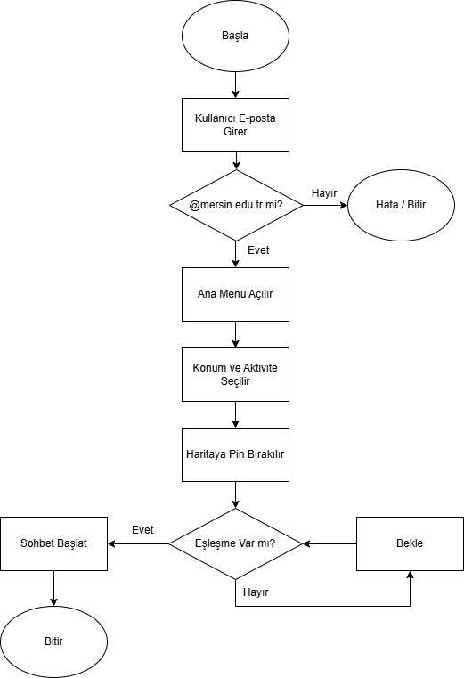
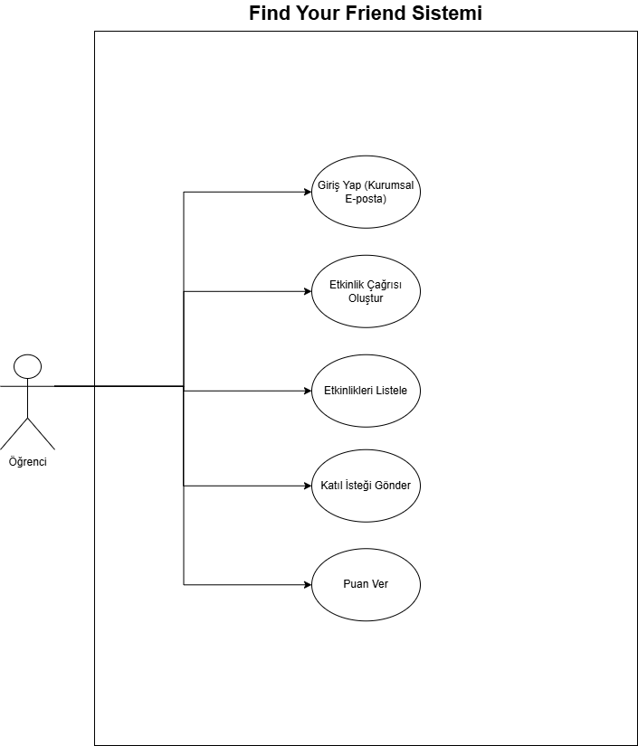

📍  Find Your Friend 📍

\*\*Üniversite Kampüslerinde Sosyal Etkileşimi Artıran Güvenli Mobil Platform\*\*

Bu proje, \*\*Yazılım Modelleme ve Proje Yönetimi\*\* dersi kapsamında geliştirilmiştir. Projenin temel amacı, üniversite öğrencilerinin kampüs içerisinde güvenli bir şekilde sosyalleşmesini, spor ve oyun partneri bulmasını sağlamaktır.

## 📊 Yazılım Modelleme ve Diyagramlar

Projenin teknik ve mantıksal tasarımı aşağıda detaylandırılmıştır.

### 1. Akış Diyagramı (Flowchart)
Kullanıcının sisteme giriş yapmasından, etkinlik oluşturup eşleşme sağlamasına kadar olan süreç:

### 2. Use Case (Kullanım Durumu) Şeması
Öğrenci aktörünün sistem üzerindeki yetenekleri ve etkileşimleri:

---

\## 🚀 Özellikler

\*\*Güvenli Giriş:\*\* Sadece `@mersin.edu.tr` uzantılı kurumsal e-posta ile kayıt olunabilir.

\*\*Anlık Konum:\*\* Kampüs haritası üzerinde anlık etkinlik "pin"leri oluşturulabilir.

\*\*Etkinlik Eşleşmesi:\*\* Satranç, futbol, voleybol gibi aktiviteler için partner bulunabilir.

\*\*Güven Skoru:\*\* Aktivite sonrası kullanıcılar birbirini puanlayarak güvenilir bir topluluk oluşturur.

\## 🛠️ Kurulum (Installation)

Projeyi bilgisayarınızda çalıştırmak için aşağıdaki adımları izleyin:

1\. \*\*Projeyi Klonlayın:\*\*

&nbsp;  Terminali açıp aşşağıdaki kodları yazın

&nbsp;  git clone https://github.com/Brostez/FindYourFriend.git

&nbsp;  cd FindYourFriend

2\. \*\*Sanal Ortamı Oluşturun ve Aktif Edin:\*\*

&nbsp;  Kurulan dosyayı açın ve dosyaya sağ tıklayıp terminali açıp aşağıdaki kodları yazın

&nbsp;  python -m venv venv

&nbsp;  .\\venv\\Scripts\\activate

3\. \*\*Gereksinimleri Yükleyin:\*\*

&nbsp;  pip install -r requirements.txt

4\. \*\*Sunucuyu Başlatın:\*\*

&nbsp;  python src/main.py

🎮 Kullanım ve Test Senaryoları (Usage)

Proje şu an backend prototip aşamasındadır. Sunucu çalışırken (python src/main.py), testleri gerçekleştirmek için yeni bir terminal (PowerShell) açarak aşağıdaki komutları kullanabilirsiniz.

1\. \*\*Güvenli Giriş Testi (Login)\*\*

Sisteme @mersin.edu.tr uzantılı mail ile giriş isteği gönderir.

Invoke-RestMethod -Uri "http://127.0.0.1:5000/api/login" -Method Post -ContentType "application/json" -Body '{"email": "berat@mersin.edu.tr"}'

2\. \*\*Etkinlik Oluşturma Testi (Create Event)\*\*

Haritaya yeni bir etkinlik pini bırakır. (Örn: Satranç).

Invoke-RestMethod -Uri "http://127.0.0.1:5000/api/create_event" -Method Post -ContentType "application/json" -Body '{"kullanici": "berat@mersin.edu.tr", "aktivite": "Satranc", "konum": "Kutuphane Onu"}'

3\. \*\*Etkinlikleri Listeleme (List Events)\*\*

Oluşturulan etkinlikleri görmek için tarayıcınızdan şu adrese gidebilirsiniz: http://127.0.0.1:5000/api/list_events

Veya terminalden:

Invoke-RestMethod -Uri "http://127.0.0.1:5000/api/list_events" -Method Get

📂 Proje Yapısı

src/: Python kaynak kodları (Backend simülasyonu).

docs/: Yazılım modelleme dokümanları (Akış diyagramı, Use Case, Senaryolar).

requirements.txt: Gerekli kütüphane listesi.

👥 Proje Ekibi

Berat Yıldız - Proje Yöneticisi \& Backend Developer

Mehmet Bekir Sürmeli - UI/UX Tasarım

Acar Efe Yaman - Mobil Geliştirme

Ayşe Pelin Demirel - Veritabanı \& Analiz

---------------------------------------------------

Mersin Üniversitesi - 2025

